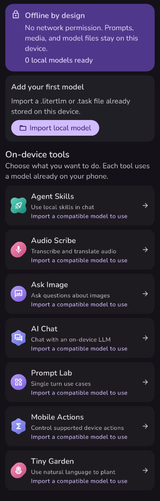
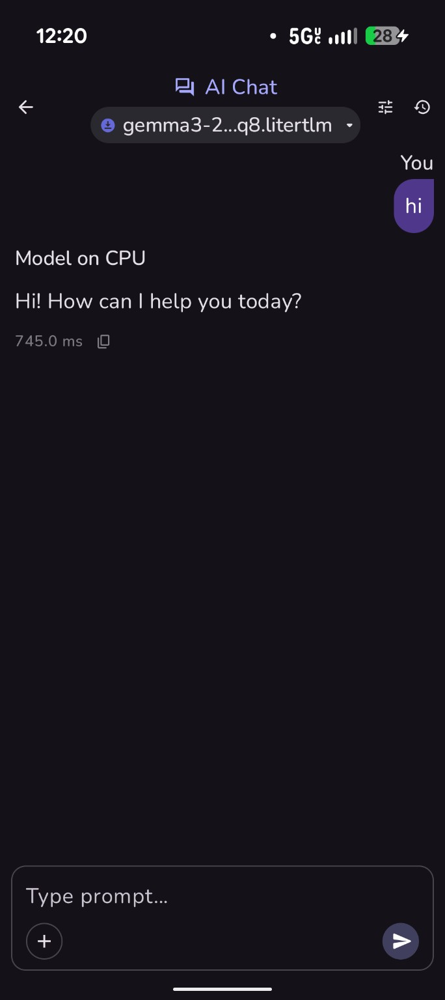

# Offline AI Gallery

**Run compatible AI models locally on Android, without cloud services, online model catalogs, analytics, or network access.**

Offline AI Gallery is an independent, privacy-focused fork of
[Google AI Edge Gallery](https://github.com/google-ai-edge/gallery), rebuilt around an explicit
offline boundary and a smaller, local-first interface.

[Download the first offline preview](https://github.com/freneticphonetic/gallery/releases/tag/v1.0.16-offline.1)
·
[View development instructions](DEVELOPMENT.md)

> **Pre-release:** The core offline workflow is functional, but bugs, unfinished features, and
> compatibility issues should still be expected.

## Screenshots

  
  &nbsp;&nbsp;
  

## Offline by design

Privacy does not depend on a setting or a promise:

- The app does not request `INTERNET` or `ACCESS_NETWORK_STATE`.
- Manifest removal rules prevent transitive dependencies from adding those permissions back.
- Firebase Analytics, Firebase Cloud Messaging, OAuth, remote model catalogs, and in-app model
  downloads are removed.
- Android cloud backup is disabled.
- Models are imported only through Android's local document picker.
- Prompts, media, conversations, skill data, and model files remain on the device.
- Inference runs locally through the
  [LiteRT-LM](https://github.com/google-ai-edge/LiteRT-LM) runtime.
- No Google account, Play Services connection, or Google terms acceptance is required.

Camera, microphone, calendar, and notification permissions remain optional because individual
on-device tools may use those Android features. They are requested only when the relevant feature
needs them.

## First offline preview

Release [`v1.0.16-offline.1`](https://github.com/freneticphonetic/gallery/releases/tag/v1.0.16-offline.1)
is the first installable preview of the offline fork.

The core application now:

- Builds as an installable Android APK.
- Launches without network permission.
- Imports compatible `.litertlm` and `.task` model files from local storage.
- Stores and manages imported models on the device.
- Routes models to tools based on their declared capabilities.
- Loads a local language model and performs successful on-device inference.
- Supports local model deletion and benchmarking.
- Provides light, dark, and system theme options.

The release was tested on a physical Android device with
`gemma3-270m-it-q8.litertlm`. The model imported successfully, loaded on the CPU, and produced an
AI Chat response entirely on-device.

Performance and compatibility vary by model, Android device, and selected accelerator.

## Included tools

The interface currently exposes these on-device tools:

- **AI Chat** — Chat with a compatible local language model.
- **Prompt Lab** — Run single-turn prompts and experiments.
- **Ask Image** — Ask questions about images using a compatible multimodal model.
- **Audio Scribe** — Transcribe or translate audio with a compatible model.
- **Agent Skills** — Use supported local skills in chat.
- **Mobile Actions** — Control supported device actions.
- **Tiny Garden** — Use natural language to manage the included garden experience.

A tool remains unavailable until a model declaring compatible capabilities has been imported.

Not every tool or model combination has been fully tested in this preview.

## Install the app

1. Open the
   [latest release](https://github.com/freneticphonetic/gallery/releases/tag/v1.0.16-offline.1).
2. Download `Offline-AI-Gallery.apk`.
3. Optionally verify it using `Offline-AI-Gallery.apk.sha256`.
4. Open the APK on an Android 12 or newer device.
5. Allow installation from your browser or file manager if Android requests permission.
6. Choose **Install anyway** if Google Play Protect warns that it has not seen this developer before.

The APK is sideloaded and is not distributed through Google Play.

This preview currently uses development signing. A later build signed with a different key may
require uninstalling the previous version before installation.

## Import a model

1. Copy a compatible `.litertlm` or `.task` file onto the device.
2. Open **Local models** in Offline AI Gallery.
3. Choose **Import model**.
4. Select the model file using Android's document picker.
5. Review its settings and declare the capabilities it supports.
6. Open the imported model and choose a compatible tool.

Offline AI Gallery does not discover, recommend, or download models. Model acquisition happens
outside the app so the installed application remains useful without a network connection.

## Current limitations

This is an early pre-release rather than a production-ready application.

Known limitations include:

- Bugs and rough interface edges remain.
- Model compatibility is not yet comprehensively documented.
- Model files are not bundled with the APK.
- Some tools have not been thoroughly tested.
- Hardware acceleration depends on the model, device, and LiteRT-LM support.
- Imported capability settings currently rely partly on information supplied by the user.
- The internal Kotlin namespace still reflects the upstream project.
- Dormant upstream implementation code still requires further cleanup.
- The app does not yet include a complete in-app third-party license viewer.

Back up important local data before replacing or uninstalling a pre-release build.

## What changed from the upstream foundation

- Replaced the promotional, tabbed home page with a compact task list and clear first-run setup.
- Reworked model management around a single local-file import path.
- Added visible offline and privacy status.
- Removed Google account and terms prompts.
- Removed Firebase services, online catalogs, OAuth, and remote model downloads.
- Removed Play Services model delegates and AICore integration.
- Removed Hugging Face authentication.
- Limited built-in Agent Skills to operations intended to work locally.
- Hid remote MCP configuration.
- Rebranded the application, package ID, icon, and color system for this fork.

## Development

Android build instructions are available in [DEVELOPMENT.md](DEVELOPMENT.md).

A tool remains unavailable until a model declaring compatible capabilities has been imported.

Not every tool or model combination has been fully tested in this preview.

## Install the app

1. Open the
   [latest release](https://github.com/freneticphonetic/gallery/releases/tag/v1.0.16-offline.1).
2. Download `Offline-AI-Gallery.apk`.
3. Optionally verify it using `Offline-AI-Gallery.apk.sha256`.
4. Open the APK on an Android 12 or newer device.
5. Allow installation from your browser or file manager if Android requests permission.
6. Choose **Install anyway** if Google Play Protect warns that it has not seen this developer before.

The APK is sideloaded and is not distributed through Google Play.

This preview currently uses development signing. A later build signed with a different key may
require uninstalling the previous version before installation.

## Import a model

1. Copy a compatible `.litertlm` or `.task` file onto the device.
2. Open **Local models** in Offline AI Gallery.
3. Choose **Import model**.
4. Select the model file using Android's document picker.
5. Review its settings and declare the capabilities it supports.
6. Open the imported model and choose a compatible tool.

Offline AI Gallery does not discover, recommend, or download models. Model acquisition happens
outside the app so the installed application remains useful without a network connection.

## Current limitations

This is an early pre-release rather than a production-ready application.

Known limitations include:

- Bugs and rough interface edges remain.
- Model compatibility is not yet comprehensively documented.
- Model files are not bundled with the APK.
- Some tools have not been thoroughly tested.
- Hardware acceleration depends on the model, device, and LiteRT-LM support.
- Imported capability settings currently rely partly on information supplied by the user.
- The internal Kotlin namespace still reflects the upstream project.
- Dormant upstream implementation code still requires further cleanup.
- The app does not yet include a complete in-app third-party license viewer.

Back up important local data before replacing or uninstalling a pre-release build.

## What changed from the upstream foundation

- Replaced the promotional, tabbed home page with a compact task list and clear first-run setup.
- Reworked model management around a single local-file import path.
- Added visible offline and privacy status.
- Removed Google account and terms prompts.
- Removed Firebase services, online catalogs, OAuth, and remote model downloads.
- Removed Play Services model delegates and AICore integration.
- Removed Hugging Face authentication.
- Limited built-in Agent Skills to operations intended to work locally.
- Hid remote MCP configuration.
- Rebranded the application, package ID, icon, and color system for this fork.

## Development

Android build instructions are available in [DEVELOPMENT.md](DEVELOPMENT.md).
